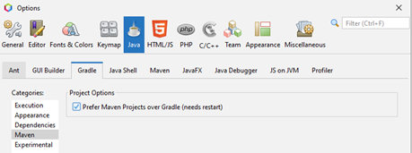
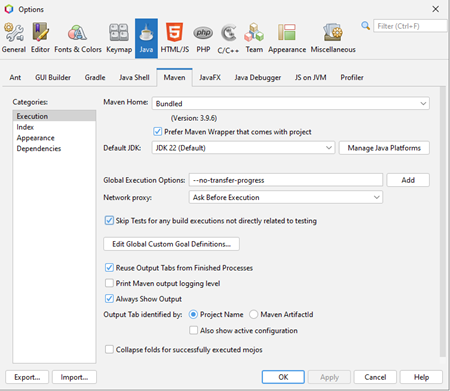
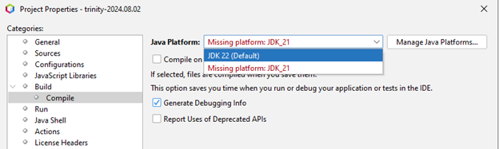

## Software

- Java 21+

  - OpenJDK: <https://jdk.java.net/21/>
  - Adoptium (Temurin): <https://adoptium.net/>
  - Note: Trinity compiles at JDK21 by default.

- Apache Maven

  - Available at: <https://maven.apache.org/download.cgi>
  - Latest Version Tested: 3.9.11

- Git

  - Available at: <https://git-scm.com/downloads>
  - Latest Version Tested: 2.50.1

- Apache NetBeans IDE
  - Available at:
    [https://NetBeans.apache.org/front/main/index.html](https://netbeans.apache.org/front/main/index.html)
  - Latest Version Tested: Apache NetBeans 26
  - Note: Other IDEs will work, just has been tested on Apache NetBeans and
    IntelliJ.

## Local Deployment

- Clone the repository to a local directory.
  - Note: The current build requires cloning, as git dependencies are necessary.
- Open Apache NetBeans (or IDE of choice) and import the project.
- For IntelliJ
  - Option 1. Import Trinity as a Gradle Project
  - Option 2. Import Trinity as a Maven Project (CMD+Shift+A --> Reload All
    Maven Projects)
    - Change SDK: File --> Project Structure --> SDK
- For NetBeans (Maven Only), the following settings need to be changed.
  - On the menu-bar, Select Tools --> Options
    - In the 'Java' menu, Gradle sub-category, Maven. Select "Prefer Maven
      Projects over Gradle". Restart if needed.
      - 
    - In the 'Java' menu, Maven sub-category,
      - Select "Skip Tests for any build executions not directly related to
        testing".
      - 
  - In case issues are observed, right-click on the project and on 'Resolve
    Project Problems'.
    - 
    - 
- From Terminal
  - For a build using Maven, execute `.\mvnw clean install -DskipTests` in the
    cloned directory.
  - For a build using Gradle, execute `.\gradlew clean assemble` in the cloned
    directory.
  - On Windows, you may need to run terminal as administrator.

## NetBeans Configurations

Several configurations are available. Functions are marked as follows:


- 4kMemory – Allocates extra VRAM and Heap space to account for 4k monitors

- DalleWalle – Runs Dalle Walle Easter Egg

- OutRun – Starts Trinity with 3D Outrun vaporwave city scene

- Automatically enables Mp3 Jukebox with autoplay

- VRAMDebug – adds additional JavaFX debugging flags at command line to
  determine VRAM statistics at runtime

- ZeroMQ – automatically enables ZeroMQ listener/subscriber

- Assembly – Generates "Fat" assembly jar

- http – automatically enables HTTP REST receiver

- Release-profile – simple slim compile/build

## Reported Issues

### Q: Cannot pull from GitHub due to SSL errors

**Solution**: Pull from GitHub without SSL certificates then change the git
configuration for that directory. Note, this is insecure. Ensure you only do so
from a trusted network.

```console
git -c http.sslVerify=false clone
```
