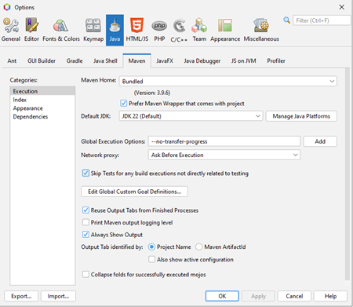
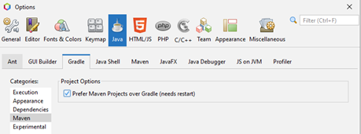
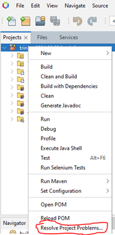
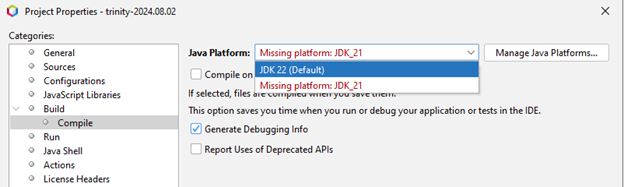
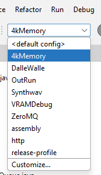

# Software

- Java 24+

  - OpenJDK: <https://jdk.java.net/24/>

  - Adoptium: <https://adoptium.net/>

<!-- -->

- Note: Trinity compiles at JDK21 by default.

<!-- -->

- Apache Maven

  - Available at: <https://maven.apache.org/download.cgi>

  - Latest Version Tested: 3.9.8

- Git

  - Available at: <https://git-scm.com/downloads>

  - Latest Version Tested: 2.46.0

- Trinity Repository

  - Available at: <https://github.com/trinity-xai/Trinity>

- Apache NetBeans IDE

  - Available at:
    [https://NetBeans.apache.org/front/main/index.html](https://netbeans.apache.org/front/main/index.html)

  - Latest Version Tested: Apache NetBeans 26

  - Note: Other IDEs will work, just has been tested on Apache NetBeans
    and Intellij.

# 

# 

# 

# 

# 

# 

# Local Deployment

- Clone the repository to a local directory.

  - Note: The current build requires cloning, as git dependencies are
    necessary.

- Open CMD, execute “mvn clean install -DskipTests” in the cloned
  directory.

  - Windows: Run CMD as administrator.

- Open Apache NetBeans (or IDE of choice) and import the project.

- For Intellij, add Trinity as a maven project (CMD+Shift+A -\> Reload
  All Maven Projects)

  - Change SDK: File -\> Project Structure -\> SDK

- For NetBeans, the following settings need to be changed.

  - On the menu-bar, select tools-\>options

    - In the ‘Java’ menu, Gradle sub-category, Maven. Select “Prefer
      Maven Projects over Gradle”. Restart if needed.

    - In the ‘Java’ menu, Maven sub-category,

      - select “Skip Tests for any build executions not directly related
        to testing”.

> 
>
> 

- In case issues are observed, right click on the project and on
  ‘Resolve Project Problems’.

# Configurations

Several configurations are available. Functions are marked as follows:

- 4kMemory – Allocates extra VRAM and Heap space to account for 4k
  monitors

- DalleWalle – Runs Dalle Walle Easter Egg

- OutRun – Starts Trinity with 3D Outrun vaporwave city scene

- Automatically enables Mp3 Jukebox with autoplay

- VRAMDebug – adds additional JavaFX debugging flags at command line to
  determine VRAM statistics at runtime

- ZeroMQ – automatically enables ZeroMQ listener/subscriber

- Assembly – Generates “Fat” assembly jar

- http – automatically enables HTTP REST receiver

- Release-profile – simple slim compile/build

# Known Issues

### Q: Cannot pull from Github due to SSL errors

**Solution**: Pull from Github without SSL certificates then change the
git configuration for that directory.

<table>
<colgroup>
<col style="width: 100%" />
</colgroup>
<thead>
<tr>
<th>
git -c http.sslVerify=false clone &lt;path&gt;

git config http.sslVerify “false”
</th>
</tr>
</thead>
<tbody>
</tbody>
</table>

Resource:
<https://stackoverflow.com/questions/9008309/how-do-i-set-git-ssl-no-verify-for-specific-repos-only>